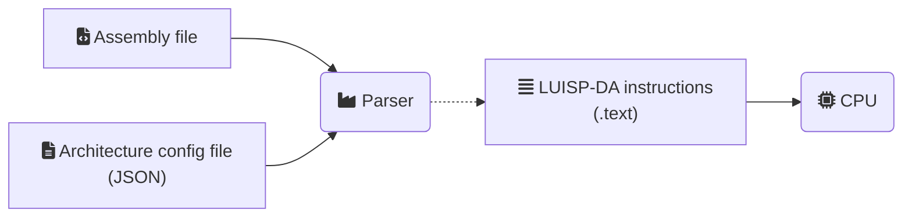

# Project architecture

## Parser

General functionality:
1. Translate from ASM to Lisp dialect (LUISP-DA) instructions using the architecture definition file (LUISP-DA instructions already codified in config file)
2. Save those instructions to memory, in order for them to be executed by the CPU

<!-- Icons from https://fontawesome.com/icons -->

### Architecture definition file
<!-- TODO -->

## LUISP-DA
assembLy analogoUs Interpreted liSP DiAlect
<!--
Lisp  
Ubiquitous  
Interpreted  
Simple  
Post  
-  
Decoding language for  
Assembly
-->

Make minimum possible set of "assembly" instructions.

## Interpreter

An interpreter for the LUISP-DA language.

## RISC-V architecture

### Instruction set

- System calls (`ecal`)
    - Print_int
    - Print_string
    - Read_int
    - Read_string
    - Exit
- Data transfer
    - `li`
    - `mv`
- Arithmetic (integer) -> convert reg to signed, operate, convert to unsigned
    - `add`
    - `addi`
    - `sub`
    - `mul`
    - `div`
    - `rem`
- Logical (integer)
    - `and`
    - `or`
    - `not`
        - 1's complement
    - `neg`
        - 2's complement
    - `xor`
    - `srli`
        - unsigned
    - `srai`
        - signed
    - `slli`
        - unsigned
    - `sra`
        - signed
    - `srl`
        - unsigned
- Branch (signed)
    - `beq`
    - `bne`
    - `blt`
    - `bge`
    - `bgt`
    - `ble`
- Memory Access
    - `la`
    - `lw`
    - `sw`
    - `lb`
    - `sb`
- Function Calls
    - `jal`
    - `jr`

The full grammar is defined in [`riscv_asm.g4`](../src/parser/riscv_asm.g4).

### Register File (`RegisterFile`)
The Register File class can be found in [register_file.hpp](../src/cpu/register_file.hpp), and takes an initializer list of strings with the names of the registers.

The class is composed of three parts:
- A vector of unsigned 32b integers `_rf` with the values of the registers (indexed by ints, as it's a vector).
- A vector of strings `_reg_names` with the names of the registers from the initializer list, which acts as a map between the register indexes (ints) and the register names (index → name).
- A map `_reg_map` between the register names and the register indexes (name → index).

This is done so you can access the value of a register either by name (that's why you need `_reg_map`) or by index, by overloading the `[]` operator, and so that you can print the names of the registers with the values (that's why you need `_reg_names`), by overloading the `<<` operator.

#### Display modes

The Register File also has different display modes. These modes control how the RF will be displayed when using the `<<` operator.  
There are three modes:
- Hexadecimal (`rfdmode::HEX`): Displays the values as hex values
- Signed (`rfdmode::SIG`): Displays the values as signed integers
- Unsigned (`rfdmode::USG`): Displays the values as unsigned integers

These modes are defined in the `rfdmode::dmode` enum and can be changed through the `RegisterFile.setdmode()` method (which the `_dmode` attribute).

---

- "GDB" interface
    - With register status
- Registers
    - Treat as unsigned
- System calls
- Memory (dynamically generated)
- GUI
- Savestates

