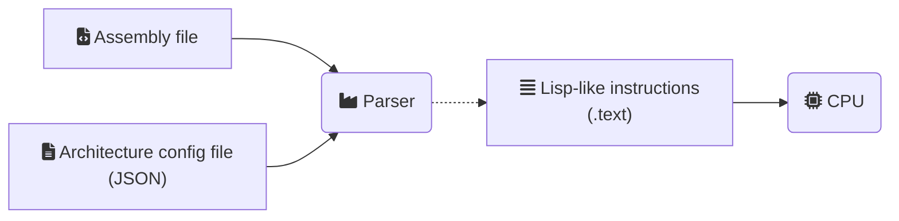

# Project architecture

## Parser

General functionality:
1. Translate from ASM to Lisp-like instructions using the architecture definition file
2. Save those instructions to memory, in order for them to be executed by the CPU.

<!-- Icons from https://fontawesome.com/icons -->

### Architecture definition file
<!-- TODO -->

## RISC-V architecture

### Instruction set

- System calls (`ecal`)
    - Print_int
    - Print_string
    - Read_int
    - Read_string
    - Exit
- Data transfer
    - `li`
    - `mv`
- Arithmetic (integer) -> convert reg to signed, operate, convert to unsigned
    - `add`
    - `addi`
    - `sub`
    - `mul`
    - `div`
    - `rem`
- Logical (integer)
    - `and`
    - `or`
    - `not`
        - 1's complement
    - `neg`
        - 2's complement
    - `xor`
    - `srli`
        - unsigned
    - `srai`
        - signed
    - `slli`
        - unsigned
    - `sra`
        - signed
    - `srl`
        - unsigned
- Branch (signed)
    - `beq`
    - `bne`
    - `blt`
    - `bge`
    - `bgt`
    - `ble`
- Memory Access
    - `la`
    - `lw`
    - `sw`
    - `lb`
    - `sb`
- Function Calls
    - `jal`
    - `jr`

The full grammar is defined in [`riscv_asm.g4`](../src/parser/riscv_asm.g4).

### Functionalities

---

- "GDB" interface
    - With register status
- Registers
    - Treat as unsigned
- System calls
- Memory (dynamically generated)
- GUI
- Savestates

