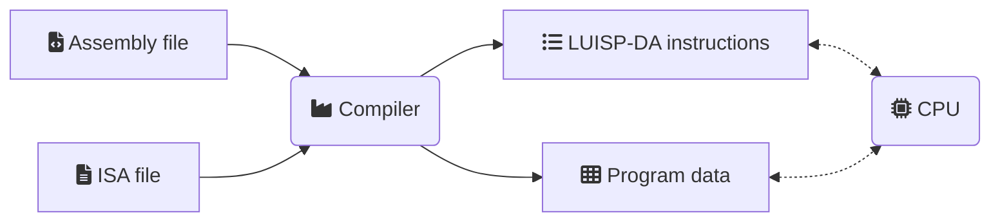
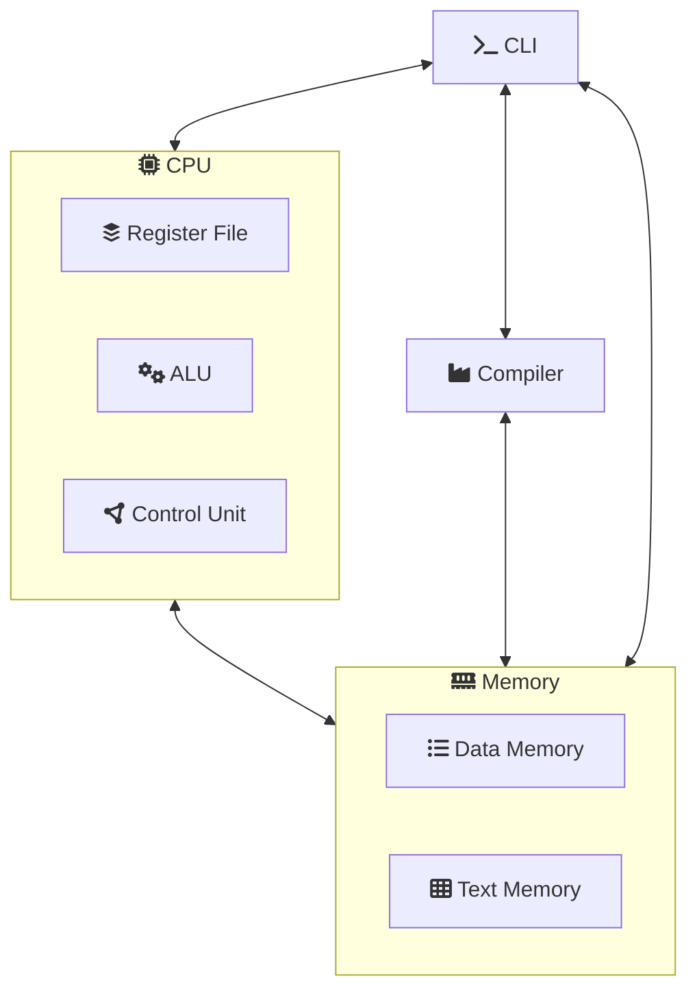

# Source code for the diagrams
The diagrams are generated using [Mermaid](https://mermaid.js.org/).

### Compilation ([`compilation.png`](compilation.png))


### Design



### Gantt ([`gantt.svg`](gantt.svg))
1. Compile [`gantt.tex`](gantt.tex)
    ```bash
    pdflatex gantt.tex
    ```
2. Transform from PDF to SVG w/ [pdf2svg](https://github.com/dawbarton/pdf2svg) (Windows binaries in [jalios/pdf2svg-windows](https://github.com/jalios/pdf2svg-windows))
    ```bash
    pdf2svg gantt.pdf gantt.svg
    ```