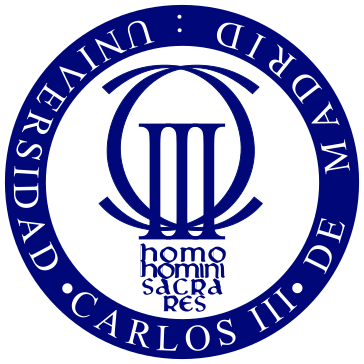
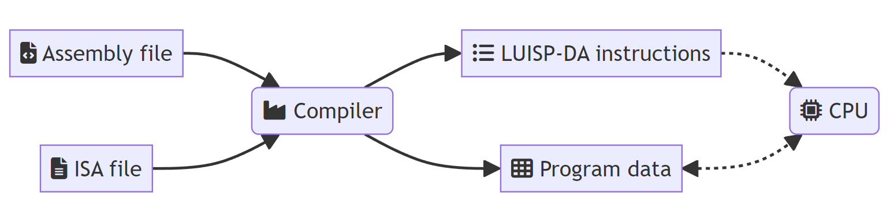
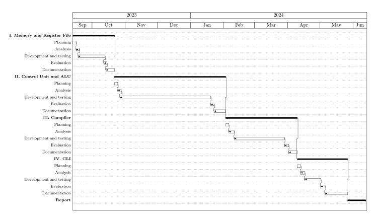

<!-- _paginate: skip -->

# Analysis, Design and Implementation of a Didactic and Generic Assembly Language Simulator
By Luis Daniel Casais Mezquida
Advisor: Prof. Alejandro Calderón Mateos

_Bachelor's Degree in Computer Science and Engineering  
Universidad Carlos III de Madrid_

Leganés, July 2024


---
<!--
"The structure of this presentation is the following"
"We start with the introduction... [next slide]"
-->
## Contents
1. Introduction: Motivation and Objectives
2. State of the Art
3. Design
4. Planning
5. Conclusions and Future Work


---

# Introduction


---
<!-- header: '**Introduction**' -->


## Motivation
<!-- There are several factors that motivated this project-->
- ISA design **matters**
    <!-- - Geopolitical climate: microchip embargoes, chip shortages have LEAD TO -->
    - Move to new and open modular designs (RISC-V)
    - Hardware acceleration (NPUs for AI)
    <!-- Recent technological advancements have lead to an increase demand for...
    - Specialized instructions
    -->
- Assembly language **matters**
    - Software built on top of hardware
    <!-- High level programming languages on top of low level. Knowing the underlying structure... -->
    - Helps us build better programs
        - Cybersecurity, efficiency, etc.
- Learning assembly language is _hard_
    - Unintuitive, depends on ISA, etc.
    <!-- There is no one "assembly language" -->
    - Few educational tools


---
<!--
-->
## Objectives
- Helping people learn assembly language programming
    - Understanding underlying concepts
- Introduce people to ISA design


---
## How?
An intuitive assembly simulator.
- Agnostic
- Easily programmable
- Interactive
<!-- - Interactive approach has been proven to help the learning process -->
- Performant
- Able to be executed in multiple platforms
- FOSS


---
<!-- header: ''-->
<!--
See what we can learn
-->
# State of the Art


---
<!-- header: 'State of the Art'-->
<!--
-- NO HABLAR DE LOS SIMULADORES -> descritos en la memoria --
-->
## Specific simulators
- Simulate one ISA, complex in-depth features (pipelining)
- E.g. [ARMLite](https://www.peterhigginson.co.uk/ARMlite/), [Kite](https://casl.yonsei.ac.kr/kite/).
  <!-- Pipelining unintuitive -->

## Generic simulators
- Simulate user-defined ISA
- Two approaches:
    1. Generate executable simulators (e.g. [Sail](https://github.com/rems-project/sail))
   <!-- generate from ISA definition -->
    2. Interpret assembly instructions (e.g. [CREATOR](https://creatorsim.github.io/))
   <!-- At runtime, using intermediate language -->

---
<!--
Plot of discussed simulators
- Proposal facilitates ISA definition
    - CREATOR goes too in detail
-->


---
<!-- header: ''-->
# Design

---
<!--
Design generic language to describe the behaviour of the instructions
-->
## LUISP-DA: _assembLy analogoUs lISP DiAlect_

- Lisp-like DSL (IR on compilers' backend)
    <!--
    - IR: Intermediate Representation
    -->
    - Simple, yet powerful, and easily validatable
    - Based on recursive expressions
        <!-- first element operator, rest arguments. Apply arguments to operator -->
        <!-- Inner expressions evaluated first -->
        ```lisp
        (+ 1 (* 2 3))
        ```
- Basic operators: arithmetic, logical, register/memory manipulation
    ```lisp
    ; addi t0 t1 69
    (reg! t0 (+ (reg t1) 69))
    ```

---

- Conditionals and blocks
    ```lisp
    ; beq t0 t1 0x000001a4
    (if (== (reg t0) (reg t1)) (pc! 0x000001a4) ())
    ```

    ```lisp
    ; jal ra 0x000001a4
    (do (reg! ra (pc)) (pc! 0x000001a4))
    ```
<!-- - Syscalls map number to type -> defined in ISA file -->
- System calls
    ```lisp
    ; exit*
    (call 0)
    (call (reg a7))
    ```


---
<!-- header: 'Design'-->
<!--
- Interpret approach
- Compile file with ISA definition into LUISP-DA, execute that
-->
## Overview



---
## Architecture
<!--
- Based on real computer architecture
-->


---
## Design choices
- C++20
    <!-- Modern, safe, efficient -->
    <!-- support for Multiple platforms (WASM) -->
    <!-- in order to learn -->
    - STL + [JSON for Modern C++](https://json.nlohmann.me/)
- Modular design
    <!-- goes down to implementation -> good for expanding -->
- LUISP-DA interpreter based on [Make a Lisp](https://github.com/kanaka/mal)
<!-- MAL is a guide to make a Lisp interpreter -->
- GPLv3
  <!-- Ensure anyone can use and improve the software -->


---
<!-- header: ''-->
# Planning


---
## Time estimation
<!--
- 9 months, 315 h (35 h/month)
- Divided in four iterations
- Hardest part was Interpreter (Control Unit)
-->



---
<!--
- Report has the breakdown
-->
## Budget
<center>

| **Concept**    |     **Cost**    |
|----------------|-----------------|
| Personnel      |     11.850,00 € |
| Equipment      |        139,44 € |
| Indirect costs |        172,40 € |
| **TOTAL**      | **12.161,84 €** |

</center>


---
<!-- header: ''-->
# Conclusions and Future Work


---
<!-- header: 'Conclusions and Future Work'-->

## Conclusions
- Fulfilled objectives
    - Instructions defined through a simple DSL
    - Portable to multiple platforms
    - Easily expandable
- Gained knowledge
    - Compiler design
    - Modern C++


---
## Future Work
<!--
There are many ways to expand the simulator. The time constraints caused many ideas to be left as future work.
This slides sumarizes some of them, such as...
-->
- More operators (floating point, bitwise, etc.)
- Browser support (WASM)
- Ease of use features (breakpoints, save states, etc.)
- GUI
- Indirect addressing
- Implementation improvements
    - `std::variant` for tokens
    - C++20 modules
    - C++23


---
<!-- header: ''-->
# Demo


---
<!-- _paginate: skip -->

# Analysis, Design and Implementation of a Didactic and Generic Assembly Language Simulator
By Luis Daniel Casais Mezquida
Advisor: Prof. Alejandro Calderón Mateos

_Bachelor's Degree in Computer Science and Engineering  
Universidad Carlos III de Madrid_

Leganés, July 2024